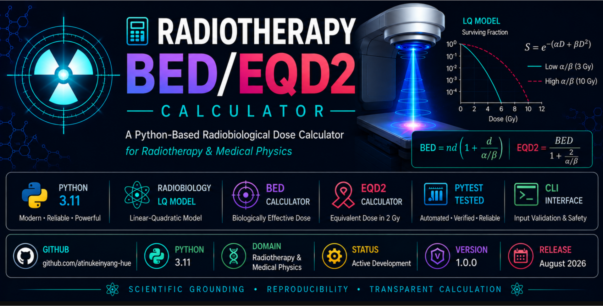

<p align="center">
  
</p>

# 🧮 Radiotherapy BED/EQD2 Calculator


> 🚧 **Project Status: Active Development — Latest stable release: Version 1.0.0**
>
> The current development branch extends Version 1.0.0 with stronger validation, conventional α/β presets, a safer command-line interface, and expanded automated testing.

## *A Python-Based Radiobiological Dose Calculator for Radiotherapy and Medical Physics*

---

## 📌 Overview

The **Radiotherapy BED/EQD2 Calculator** is a Python-based project for calculating:

- Total physical dose
- Biologically Effective Dose (BED)
- Equivalent Dose in 2 Gy fractions (EQD2)

for radiotherapy fractionation schedules.

The project combines **radiobiology, medical physics, Python programming, input validation, conventional α/β presets, and automated scientific testing**.

Radiotherapy schedules cannot always be compared using total physical dose alone.

For example:

```text
8 Gy × 3 fractions = 24 Gy

2 Gy × 12 fractions = 24 Gy
```

Both schedules deliver a total physical dose of **24 Gy**, but they are not biologically equivalent.

The calculator therefore uses the **Linear-Quadratic (LQ) model** to account for the effect of fraction size.

---

## ✨ Current Features

The current development branch includes:

- Total physical dose calculation
- BED calculation
- EQD2 calculation
- User-defined dose per fraction
- User-defined number of fractions
- Tumour/early-responding tissue α/β preset of 10 Gy
- Late-responding normal-tissue α/β preset of 3 Gy
- Custom α/β entry
- Safer interactive command-line interface
- Repeated calculations without restarting the application
- Clear error messages and retry prompts
- Empty-input validation
- Non-numeric-input validation
- Non-finite-input validation
- Zero and negative-input validation
- Whole-number validation for fraction counts
- Graceful cancellation with `Ctrl+C`
- Automated scientific testing with pytest
- Conventional fractionation test cases
- HDR tumour fractionation test cases
- HDR late-responding tissue fractionation test cases
- End-to-end CLI testing
- **40 passing automated tests**

---

## 🧬 Scientific Background

### 1. Total Physical Dose

For a fractionation schedule where:

- `n` = number of fractions
- `d` = dose per fraction

the total physical dose is:

```text
Total Physical Dose = n × d
```

For example:

```text
8 Gy × 3 fractions = 24 Gy
```

However, physical dose alone does not account for the biological consequences of changing the dose per fraction.

---

### 2. Linear-Quadratic Model

The calculator uses the **Linear-Quadratic model** as the basis for its radiobiological calculations.

The LQ model describes radiation effect using two components:

- **α (alpha)** — the linear component
- **β (beta)** — the quadratic component

The **α/β ratio** describes the sensitivity of a particular tissue or biological endpoint to changes in fraction size.

---

### 3. Alpha/Beta Ratio

Different tissues and tumour endpoints may have different α/β values.

#### High α/β

A commonly used conventional value for many tumours and early-responding tissues is:

```text
α/β = 10 Gy
```

These calculations are often described using notation such as:

```text
BED10
```

#### Low α/β

A commonly used conventional value for many late-responding normal-tissue endpoints is:

```text
α/β = 3 Gy
```

These calculations are often described using notation such as:

```text
BED3
```

These values are **conventional assumptions, not universal biological constants**.

The appropriate α/β ratio depends on factors including:

- Tissue
- Tumour type
- Biological endpoint
- Clinical context
- Supporting evidence

---

## 🧮 BED Calculation

The **Biologically Effective Dose** is calculated using:

```text
BED = nd × (1 + d / (α/β))
```

where:

```text
n     = number of fractions
d     = dose per fraction
α/β   = alpha/beta ratio
```

BED provides a model-based representation of the biological effect of a fractionation schedule.

---

## 📊 EQD2 Calculation

**Equivalent Dose in 2 Gy fractions (EQD2)** converts BED into the equivalent dose that would produce the same modelled biological effect if delivered using 2 Gy fractions.

The equation is:

```text
EQD2 = BED / (1 + 2 / (α/β))
```

This allows different fractionation schedules to be compared using a common 2-Gy-per-fraction reference.

---

## 🔬 Worked Example 1 — Conventional Fractionation

Consider:

```text
Dose per fraction = 2 Gy
Number of fractions = 25
α/β = 10 Gy
```

### Physical Dose

```text
2 × 25 = 50 Gy
```

### BED

```text
BED10 = 60 Gy10
```

### EQD2

```text
EQD2 = 50 Gy
```

Therefore:

```text
Physical Dose = 50.00 Gy
BED10         = 60.00 Gy10
EQD2          = 50.00 Gy
```

Because this schedule already uses **2 Gy fractions**, its EQD2 equals its physical dose.

---

## 🎯 Worked Example 2 — HDR Tumour Calculation

Consider:

```text
Dose per fraction = 8 Gy
Number of fractions = 3
α/β = 10 Gy
```

### Physical Dose

```text
8 × 3 = 24 Gy
```

### BED

```text
BED10 = 43.20 Gy10
```

### EQD2

```text
EQD2 = 36.00 Gy
```

Therefore:

```text
Physical Dose = 24.00 Gy
BED10         = 43.20 Gy10
EQD2          = 36.00 Gy
```

---

## 🫀 Worked Example 3 — Late-Responding Normal Tissue

Now use the same physical fractionation:

```text
Dose per fraction = 8 Gy
Number of fractions = 3
α/β = 3 Gy
```

The physical dose remains:

```text
24 Gy
```

However:

```text
BED3 = 88.00 Gy3
```

and:

```text
EQD2 = 52.80 Gy
```

Therefore:

```text
Physical Dose = 24.00 Gy
BED3          = 88.00 Gy3
EQD2          = 52.80 Gy
```

This demonstrates an important radiobiological principle:

> **The same physical fractionation schedule can produce very different modelled biological effects depending on the α/β ratio used.**

---

## 📁 Project Structure

```text
radiotherapy-eqd2-calculator/
│
├── eqd2_calculator/
│   ├── __init__.py
│   ├── calculator.py
│   └── presets.py
│
├── tests/
│   ├── test_app.py
│   ├── test_calculator.py
│   └── test_presets.py
│
├── assets/
│   └── radiotherapy-eqd2-banner.png
│
├── app.py
├── README.md
├── requirements.txt
└── .gitignore
```

Local development directories such as:

```text
.venv/
__pycache__/
.pytest_cache/
```

are excluded from version control.

---

## ⚙️ Core Calculation Functions

The scientific calculation logic is separated from the user interface and stored in:

```text
eqd2_calculator/calculator.py
```

The module contains three core functions:

```python
calculate_total_dose()
calculate_bed()
calculate_eqd2()
```

This separation keeps the scientific calculation engine independent from the command-line interface and makes the functions easier to test and extend.

The conventional α/β presets are stored separately in:

```text
eqd2_calculator/presets.py
```

This module currently provides:

```text
tumour       = 10 Gy
late_tissue  = 3 Gy
```

The values are presented as conventional educational defaults and should be verified against the relevant tissue, endpoint, clinical context, and supporting evidence.

---

## 💻 Installation

### 1. Clone the Repository

```bash
git clone https://github.com/atinukeinyang-hue/radiotherapy-eqd2-calculator.git
```

### 2. Enter the Project Directory

```bash
cd radiotherapy-eqd2-calculator
```

### 3. Create a Virtual Environment

```bash
python -m venv .venv
```

### 4. Activate the Virtual Environment

On Windows PowerShell:

```powershell
.\.venv\Scripts\Activate.ps1
```

### 5. Install Dependencies

```bash
python -m pip install -r requirements.txt
```

---

## ▶️ Running the Calculator

From the project root, run:

```bash
python app.py
```

The calculator asks for:

```text
Dose per fraction (Gy):
Number of fractions:
```

It then displays the α/β selection menu:

```text
1. Tumour / early-responding tissue (10 Gy)
2. Late-responding normal tissue (3 Gy)
3. Enter a custom alpha/beta value
```

### Example

```text
Radiotherapy BED/EQD2 Calculator
--------------------------------

Dose per fraction (Gy): 8
Number of fractions: 3

Alpha/Beta Selection
--------------------
1. Tumour / early-responding tissue (10 Gy)
2. Late-responding normal tissue (3 Gy)
3. Enter a custom alpha/beta value

Select an option (1-3): 1
```

The application produces:

```text
Results
-------
Alpha/Beta selection: Tumour / early-responding tissue
Alpha/Beta value: 10.00 Gy
Total physical dose: 24.00 Gy
BED: 43.20 Gy10
EQD2: 36.00 Gy
```

After displaying the results, the user can perform another calculation or close the calculator.

---

## 🛡️ Input Validation

The calculator includes input validation to prevent invalid values from being processed.

The scientific calculation functions require valid positive inputs such as:

```text
Dose per fraction > 0
Number of fractions > 0
Alpha/Beta > 0
BED > 0
```

The calculator also rejects:

- Empty input
- Letters and other non-numeric input
- `NaN`
- Positive infinity
- Negative infinity
- Zero
- Negative values
- Decimal fraction counts
- Boolean values passed into the scientific functions
- Unknown preset names

Invalid CLI input generates a clear error and another prompt instead of crashing the application.

---

## 🧪 Automated Scientific Testing

The project uses **pytest** for automated testing.

Run:

```bash
python -m pytest
```

The current test suite contains **40 passing tests** covering:

- Total physical dose
- BED
- EQD2
- Conventional 2 Gy fractionation
- HDR tumour fractionation
- HDR late-responding tissue fractionation
- Zero and negative inputs
- Invalid data types
- Non-finite values
- Whole-number fraction validation
- Tumour preset selection
- Late-tissue preset selection
- Preset-name normalization
- Unknown and empty preset names
- Custom α/β entry
- CLI retry behaviour
- Continue and exit responses
- Complete end-to-end CLI calculation

For floating-point calculations, approximate numerical comparison is used where appropriate to avoid false failures caused by normal floating-point representation.

For example, Python may internally represent:

```text
36.0
```

as something extremely close to:

```text
36.00000000000001
```

even though the values are effectively equivalent for the calculation.

---

## 🧠 Why Automated Tests Matter

Scientific software should not merely produce output.

Its calculations should also be **verifiable and reproducible**.

Automated tests help detect situations where future modifications accidentally change previously verified scientific calculations.

This becomes increasingly important as the project grows to include additional radiobiological calculations.

---

## ⚠️ Scientific Limitations

This project currently implements the standard Linear-Quadratic model.

Important limitations include:

- α/β values are model parameters and should be selected according to the relevant tissue, tumour, endpoint, clinical context, and supporting evidence.
- The current presets are conventional educational defaults rather than universal biological constants.
- BED and EQD2 are model-derived quantities rather than direct measurements of biological effect.
- The basic LQ model does not represent every biological or clinical factor affecting radiation response.
- Interpretation of LQ-model calculations at very high doses per fraction requires appropriate caution.
- The current calculator evaluates individual fractionation schedules.
- The current version does not yet provide full cumulative EBRT plus brachytherapy EQD2 functionality.
- The calculator does not replace a treatment-planning system.
- The calculator does not replace institutional clinical protocols or qualified medical-physics judgment.

---

## 🚀 Planned Development

Future versions may include:

### Radiobiology

- Organ-specific OAR α/β presets
- Combined EBRT plus brachytherapy calculations
- Cumulative EQD2
- Multiple fractionation-course comparison

### Data

- CSV input
- CSV export
- Excel export

### Software Engineering

- Additional scientific validation cases
- More detailed error reporting
- Continuous integration with GitHub Actions
- Expanded documentation

### Application Development

- Web interface
- REST API integration

---

## 🎓 Intended Use

This project is intended for:

- Medical physics education
- Radiobiology learning
- Radiotherapy research demonstrations
- Python programming practice
- Scientific software development
- Healthcare software portfolio development

It is **not intended to provide clinical treatment recommendations**.

---

## ⚕️ Disclaimer

This software is an **educational and research-oriented project**.

It is **not a medical device** and has not been independently validated, approved, or certified for clinical decision-making or patient treatment.

Clinical radiobiological calculations should be independently verified using appropriate clinical protocols, validated systems, and qualified professional judgment.

---

## 👩🏽‍💻 Author

**Atinuke A. Inyang**

Medical Physics • Radiotherapy • Healthcare AI • Python

GitHub: [atinukeinyang-hue](https://github.com/atinukeinyang-hue)

---

## Built Around Three Principles

**Scientific grounding • Reproducibility • Transparent calculation**